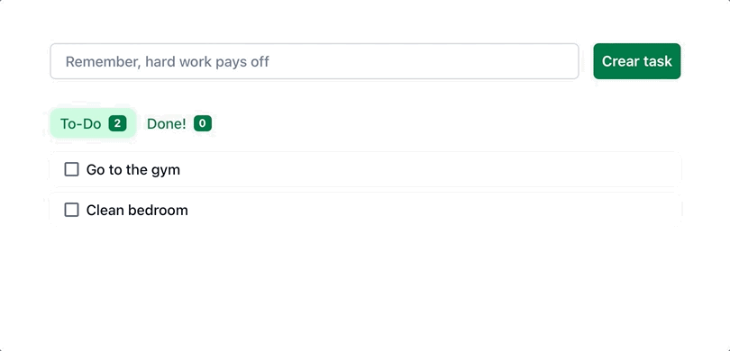

# Daily Tasks

Daily Tasks is a web application created with simplicity as its main feature, isolating the user from noise so they can focus on what's really important.

It should be taken into consideration that any user can create and delete any task.

## Demo

## Tech Stack

So far I have used the following technologies. In the future, new services will be added leading to other technologies.

**Client:** React, Chakra UI

**Server:** Node, Express

**Database:** MongoDB

## Feedback

If you have any feedback, please reach out to me at hola@jaumegelabert.dev

